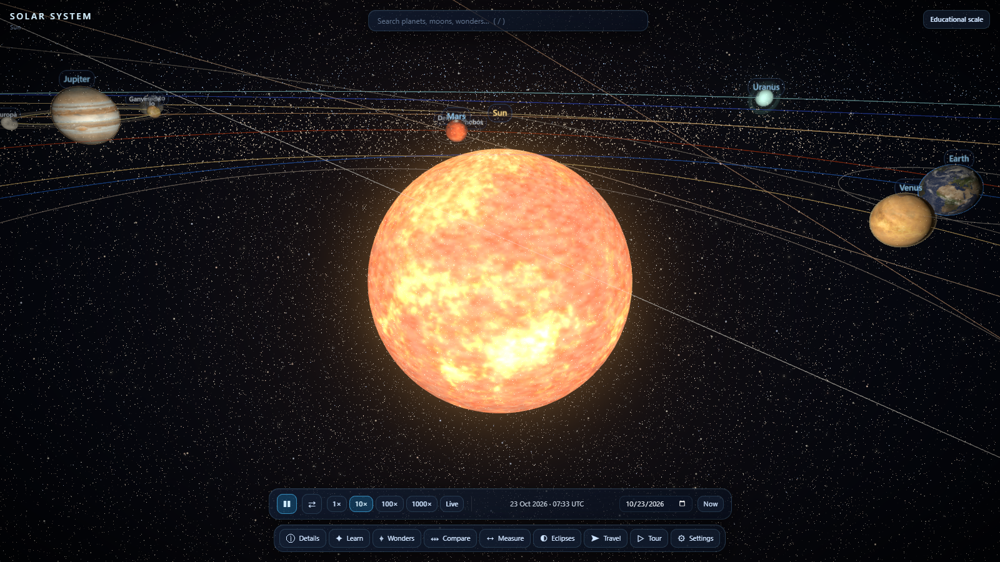
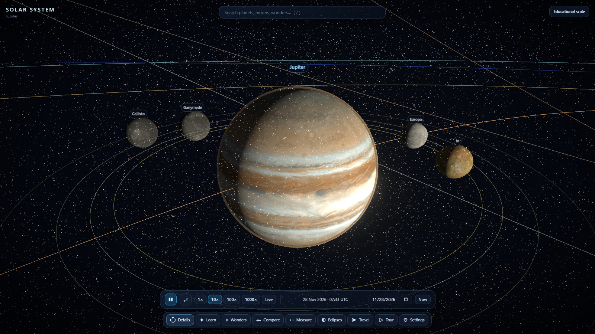
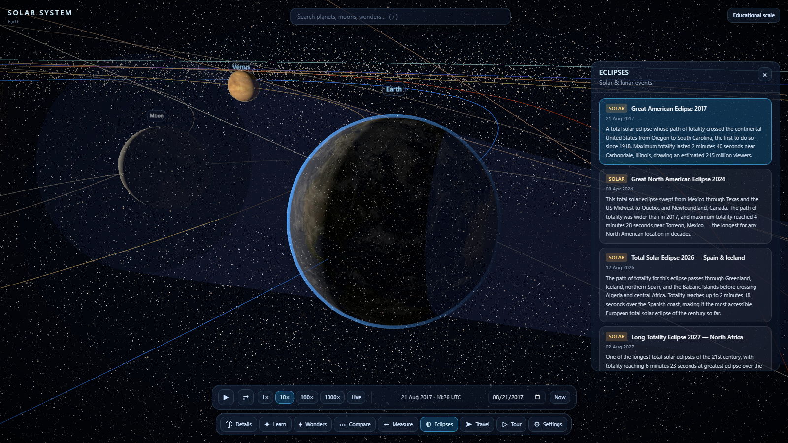
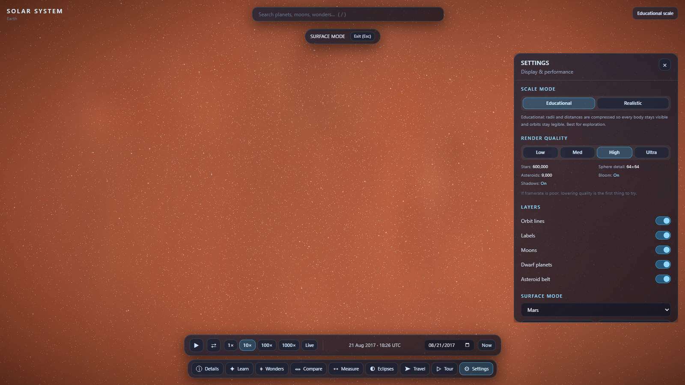
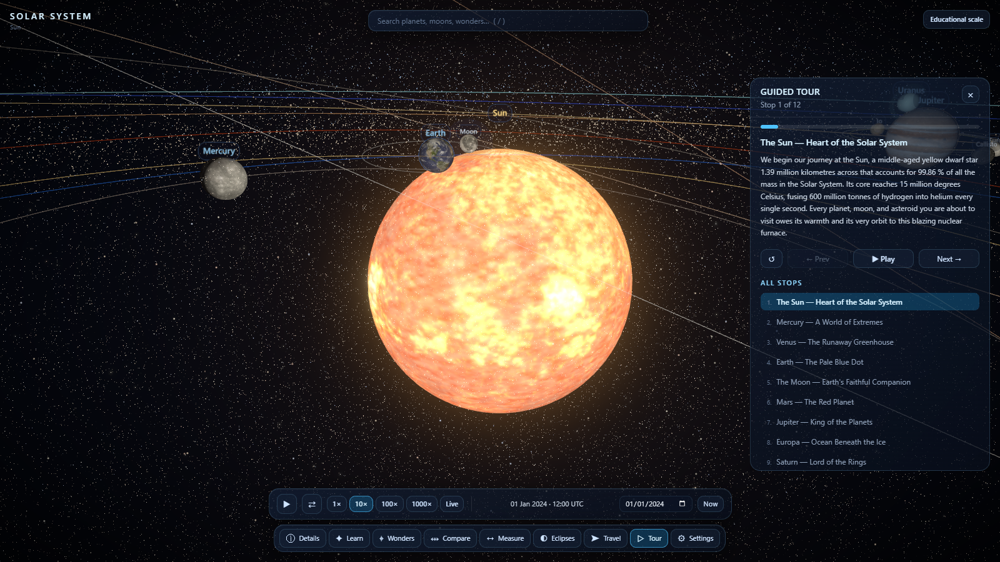
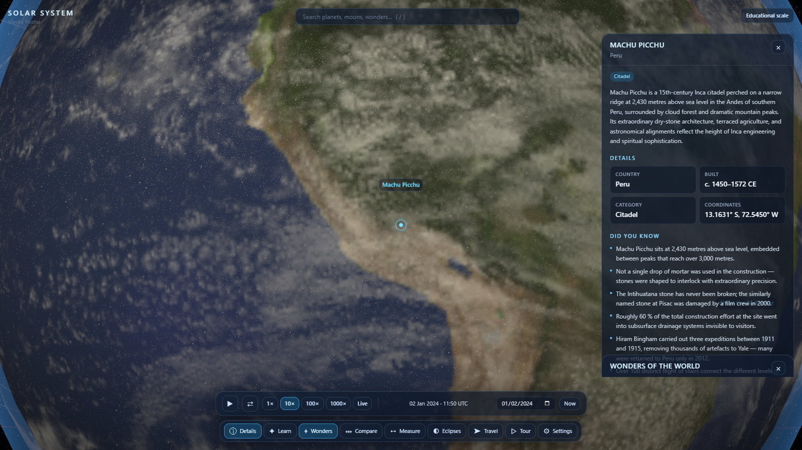

# 🪐 Solar System 3D

An interactive, scientifically grounded 3D Solar System explorer built with React 19, three.js, and real Keplerian orbital mechanics.

[](https://github.com/kuldeepcodes/solar-system-3d/actions/workflows/ci.yml)
[](https://github.com/kuldeepcodes/solar-system-3d/actions/workflows/deploy.yml)


**🌐 Live demo:** [https://kuldeepcodes.github.io/solar-system-3d/](https://kuldeepcodes.github.io/solar-system-3d/)

---

## Screenshots

<!-- Replace these placeholders with real screenshots once the app is running. Aim for 1280×720 or 1920×1080 captures. -->

| Overview | Detail Panel | Eclipse Demo |
|----------|--------------|--------------|
|  |  |  |

| Surface Mode | Guided Tour | 7 Wonders Layer |
|---|---|---|
|  |  |  |

---

## Features

### 🔭 Navigation & Camera
- **Free-flight navigation** — drag to orbit, scroll/pinch to zoom, right-drag to pan, double-click any body to focus and track it
- **Fuzzy search** — press `/` to open the search box and jump to any planet, moon, dwarf planet, or named object
- **Camera modes** — standard orbit, surface landing (first-person on a planet), and spacecraft travel with live telemetry

### 🌍 Bodies & Orbits
- All 8 planets, 200+ moons, dwarf planets (Pluto, Ceres, Eris, Makemake, Haumea), and the asteroid belt
- **Real Keplerian orbits** using J2000.0 mean elements from JPL; Kepler's equation solved every frame by Newton-Raphson iteration
- Earth's Moon carries secular node regression and periapsis precession keeping eclipse seasons correct over decades
- Orbit path overlays toggle with `O`; body labels toggle with `L`

### ⚖️ Dual Scale System
- **Educational mode** (default) — compresses sizes and distances to keep everything visible and comparable
- **Realistic mode** — true distances at 1 scene unit = 100,000 km; requires zooming out significantly
- Switch instantly in Settings without losing the current view

### 🔬 Detail Panels
Each body shows: diameter, distance from the Sun, surface temperature range, surface gravity, orbital period, number of moons, mass, bulk density, escape velocity, axial tilt, composition summary, atmospheric data, interesting facts, and an image gallery.

### ⏱️ Time Controls
- Play/pause (`Space`), 1×/10×/100×/1000× speeds, reverse time
- Date scrubber to jump to any date; all orbital positions update immediately

### 🌑 Eclipse Demonstrations
- Solar and lunar eclipse modes with accurate geometry derived from real orbital data
- Eclipse seasons stay in step across decades thanks to the Moon's node regression

### 🏔️ Earth: 7 Wonders of the World Layer
Markers placed at the true geographic coordinates of all eight sites (see [`docs/FEATURES.md`](docs/FEATURES.md) for full coordinates). Double-click a marker to fly to it; a detail card shows the site name, location, and a brief description.

### 🚀 Spacecraft Travel Mode
Point-to-point travel between any two bodies with live telemetry: elapsed time, distance covered, distance remaining, estimated arrival, and one-way light-delay.

### 🛸 Other Features
- **Planet comparison panel** — place two bodies side by side to compare their physical properties (`C`)
- **Distance measurement tool** — click two objects to read the current distance between them (`M`)
- **Guided tour** — narrated fly-through of the Solar System (`T`)
- **Learn panel** — curated educational cards for each body
- **Settings** — quality tiers (`low` / `medium` / `high` / `ultra`) gating bloom, geometry detail, and adaptive DPR

---

## Quick Start

### Prerequisites
- **Node 22+** — check with `node -v`. Use [nvm](https://github.com/nvm-sh/nvm) / [nvm-windows](https://github.com/coreybutler/nvm-windows): `nvm use` in the repo root reads `.nvmrc` automatically.

### Install & run

```bash
git clone https://github.com/kuldeepcodes/solar-system-3d.git
cd solar-system-3d
npm install
npm run dev
```

Open [http://localhost:5173](http://localhost:5173).

### Textures (optional)

The app works out-of-the-box without downloaded textures — missing textures are replaced by deterministic procedural textures generated at runtime. To get the full photorealistic look:

```bash
npm run textures
```

This downloads CC BY 4.0 textures from Solar System Scope into `public/textures/` (gitignored). See [`docs/SETUP.md`](docs/SETUP.md) for details.

---

## Available Scripts

| Script | Description |
|--------|-------------|
| `npm run dev` | Start the Vite dev server with HMR at `http://localhost:5173` |
| `npm run build` | Type-check (`tsc -b`) then bundle for production into `dist/` |
| `npm run preview` | Serve the `dist/` build locally for a production preview |
| `npm run lint` | Run oxlint across the source tree |
| `npm run typecheck` | Run `tsc -b --noEmit` without emitting files |
| `npm test` | Run Vitest in watch mode |
| `npm test -- --run` | Run Vitest once (used in CI) |
| `npm run textures` | Download CC BY 4.0 planet textures into `public/textures/` |

---

## Controls

### Mouse

| Action | Effect |
|--------|--------|
| Left-drag | Orbit / rotate the view |
| Right-drag | Pan the camera |
| Scroll wheel | Zoom in / out |
| Double-click body | Focus and track the body |
| Click empty space | Deselect / dismiss panel |

### Touch

| Gesture | Effect |
|---------|--------|
| One-finger drag | Orbit / rotate the view |
| Pinch | Zoom in / out |
| Two-finger drag | Pan the camera |
| Double-tap body | Focus and track the body |

### Keyboard

| Key | Action |
|-----|--------|
| `Space` | Play / pause simulation |
| `F` | Focus selected body |
| `R` | Reset to default view |
| `L` | Toggle body labels |
| `O` | Toggle orbit paths |
| `C` | Open comparison panel |
| `M` | Activate measure tool |
| `T` | Start guided tour |
| `/` | Focus search box |
| `Esc` | Close panel / exit current mode |

---

## How It Works

### Dual Scale System

Educational mode (default) makes the Solar System browsable without extreme zooming:

- **Radius** `r_scene = r_km^0.4 × 0.02`
- **Semi-major axis** `a_scene = a_AU^0.6 × 14`

Each body's orbital position vector is multiplied by a single scalar derived from the above formula. Because the scalar is uniform, the ellipse shape, eccentricity, and inclination are preserved exactly — only the absolute distances change.

Realistic mode maps 1 scene unit = 100,000 km so distances are proportional to reality.

### Keplerian Orbits

Orbital elements are J2000.0 mean elements from JPL Solar System Dynamics. Each frame:

1. Advance mean anomaly: `M = M₀ + n·Δt`
2. Solve Kepler's equation `M = E − e·sin(E)` by Newton-Raphson (typically 4–6 iterations to double-precision)
3. Compute true anomaly via the numerically stable half-angle form: `ν = 2·atan2(√(1+e)·sin(E/2), √(1−e)·cos(E/2))`
4. Convert to 3D ecliptic-frame Cartesian, then apply three.js's `(x_ecl, z_ecl, −y_ecl)` axis mapping so Y remains up

Earth's Moon additionally carries:
- **Secular node regression:** −0.05295 °/day (18.6-year Saros-related cycle)
- **Periapsis precession:** +0.16436 °/day

These keep eclipse seasons in step with reality across decades of simulation time.

### Eclipse Geometry

The eclipse demo positions the Sun, Earth, and Moon along their true Keplerian trajectories. A solar eclipse occurs when the Moon's shadow cone intersects Earth's surface (umbra + penumbra rendered via shader); a lunar eclipse occurs when Earth's shadow cone contains the Moon. The Moon's node regression ensures that eclipse seasons repeat with the correct ~6-month cadence.

### Texture Fallback

`npm run textures` downloads textures. If a texture file is absent at runtime, `src/lib/proceduralTexture.ts` generates a deterministic replacement using a seeded PRNG and fractal Brownian motion (fBm) noise. The seed is derived from the body name, so the same body always produces the same texture. This means a fresh clone works fully offline and CI builds never make network requests.

---

## Project Structure

```
solar-system-3d/
├── src/
│   ├── data/          # Planet, moon, dwarf planet, asteroid, wonder, mission, eclipse, and tour data
│   ├── lib/           # Pure utilities: orbital solver, scale transforms, time helpers, geo, texture loader, procedural texture
│   ├── state/         # Zustand stores (simulation state, UI state)
│   ├── scene/         # Three.js / R3F components (SolarSystem, Sun, Planet, Moon, Rings, …)
│   ├── shaders/       # GLSL shader chunks (atmosphere, sun corona)
│   └── ui/            # React HUD components (panels, controls, search, tour, …)
├── scripts/
│   └── fetch-textures.mjs   # Node script to download CC BY 4.0 textures
├── public/
│   └── textures/      # Downloaded textures (gitignored)
├── docs/              # Architecture, features, controls, data sources, roadmap docs
├── .github/workflows/ # CI and Pages deploy workflows
├── vite.config.ts
├── tsconfig.json
└── package.json
```

---

## Deployment

The [`deploy.yml`](.github/workflows/deploy.yml) workflow runs on every push to `main`:

1. Installs dependencies with `npm ci`
2. Runs `npm run build` with `BASE_PATH=/solar-system-3d/` so all asset paths are prefixed correctly for Pages
3. Copies `dist/index.html` → `dist/404.html` so client-side routing doesn't 404 on direct deep links
4. Uploads the `dist/` folder as a Pages artifact and deploys it

**One-time repo setup:** Go to **Settings → Pages → Build and deployment → Source** and select **GitHub Actions**.

The `BASE_PATH` environment variable must be set to the sub-path the app is served from (e.g. `/solar-system-3d/`). The Vite config reads `process.env.BASE_PATH` and sets it as `base`. Local development uses `/` by default.

---

## Browser Support

Requires **WebGL 2**. All evergreen browsers on desktop and mobile support WebGL 2. The app degrades gracefully to procedural textures when the network is unavailable but does not degrade further if WebGL 2 is absent — a notice is shown instead.

| Browser | Minimum version |
|---------|----------------|
| Chrome / Edge | 56+ |
| Firefox | 51+ |
| Safari | 15+ |
| iOS Safari | 15+ |
| Chrome Android | 56+ |

---

## Roadmap

See [`docs/ROADMAP.md`](docs/ROADMAP.md) for the full phased plan. Highlights:

- **VR / AR (WebXR)** — the codebase is XR-ready; controls are abstracted and no DOM overlays are inside the scene graph
- Real ephemeris integration via JPL Horizons API
- Comet and near-Earth object (NEO) catalogue
- Exoplanet systems
- Offline PWA support

---

## Credits & Licence

**Code** — MIT © 2026 kuldeepcodes. See [`LICENSE`](LICENSE).

**Textures** — CC BY 4.0, Solar System Scope / INOVE. Downloaded at setup time via `npm run textures`; not committed to this repository.

**Orbital & physical data** — NASA planetary fact sheets and JPL Solar System Dynamics. Public domain.

**Gallery imagery** — Wikimedia Commons. Per-image credits listed in [`docs/DATA-SOURCES.md`](docs/DATA-SOURCES.md).
