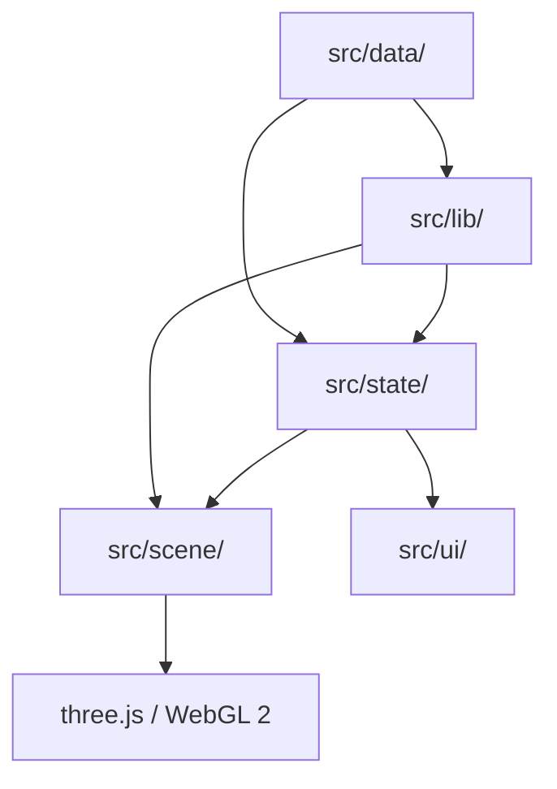

# Architecture

This document describes how Solar System 3D is structured internally — data flow, module responsibilities, state management, the render loop, coordinate conventions, and the performance strategy.

---

## High-Level Data Flow

```
┌──────────────────────────────────────────────────────────────────┐
│                          Data Layer                              │
│  src/data/  ─ planets.ts, moons.ts, dwarfs.ts, bodies.ts …      │
│  J2000 orbital elements, physical constants, wonder coordinates  │
└────────────────────────────┬─────────────────────────────────────┘
                             │ static import
                             ▼
┌──────────────────────────────────────────────────────────────────┐
│                       Library Utilities                          │
│  src/lib/orbital.ts   ─ Kepler solver, true anomaly, helio xyz  │
│  src/lib/scale.ts     ─ educational ↔ realistic transforms       │
│  src/lib/time.ts      ─ JD ↔ calendar, simulation clock         │
│  src/lib/geo.ts       ─ lat/lon → 3D surface point              │
│  src/lib/textures.ts  ─ TextureLoader with fallback dispatch     │
│  src/lib/proceduralTexture.ts ─ seeded fBm noise texture gen    │
└────────────────────────────┬─────────────────────────────────────┘
                             │ called per-frame in useFrame
                             ▼
┌──────────────────────────────────────────────────────────────────┐
│                        State Stores                              │
│  src/state/useSimStore.ts  ─ simulation time, scale mode, speed  │
│  src/state/useUIStore.ts   ─ selected body, open panels, mode   │
└──────┬──────────────────────────────────────────┬───────────────┘
       │ subscribed in scene components            │ subscribed in UI
       ▼                                           ▼
┌────────────────────────┐              ┌──────────────────────────┐
│    Scene Graph (R3F)   │              │    HUD / React UI        │
│  src/scene/            │              │  src/ui/                 │
│  SolarSystem           │              │  Hud, DetailPanel,       │
│  ├─ Sun                │              │  TimeControls,           │
│  ├─ Planet ×8          │              │  SearchBox, Settings …   │
│  │   └─ Moon ×n        │◄────────────►│                          │
│  ├─ AsteroidBelt       │  (zustand)   │                          │
│  ├─ Starfield          │              │                          │
│  ├─ OrbitPath          │              │                          │
│  ├─ CameraRig          │              │                          │
│  └─ WonderMarkers      │              │                          │
└────────────────────────┘              └──────────────────────────┘
       │
       ▼
┌────────────────────────────────────────────────────────┐
│   three.js Renderer (WebGL 2, logarithmic depth buf.)  │
│   @react-three/postprocessing bloom (quality-gated)    │
└────────────────────────────────────────────────────────┘
```

---

## Module Map

### `src/data/`

Pure TypeScript data modules — no side effects, no imports from `src/lib` or `src/scene`. Each exports a typed array of records.

| File | Contents |
|------|----------|
| `planets.ts` | 8 planets — orbital elements, physical data, atmosphere, facts |
| `moons.ts` | 200+ moons with parent references and reference frame tags |
| `dwarfs.ts` | Dwarf planets (Pluto, Ceres, Eris, Makemake, Haumea) |
| `bodies.ts` | Unified body registry merging planets, dwarfs, and major moons |
| `wonders.ts` | 7 Wonders of the World — name, lat/lon, description |
| `missions.ts` | Historic and current spacecraft missions for the tour |
| `eclipses.ts` | Notable past and future eclipse events for the demo |
| `tour.ts` | Waypoint sequence and narration text for the guided tour |

### `src/lib/`

Stateless pure functions. Each can be unit-tested in isolation.

| File | Responsibility |
|------|---------------|
| `orbital.ts` | Kepler solver (Newton-Raphson), true anomaly, heliocentric XYZ |
| `scale.ts` | Educational and realistic scale transforms for radii and distances |
| `time.ts` | Julian date arithmetic, JD ↔ Gregorian calendar, simulation clock |
| `geo.ts` | Geographic coordinate → 3D unit vector on a sphere's surface |
| `textures.ts` | `TextureLoader` wrapper; checks `public/textures/`; falls back to procedural |
| `proceduralTexture.ts` | Seeded PRNG + fBm noise → `THREE.DataTexture` |

### `src/state/`

Two [Zustand](https://github.com/pmndrs/zustand) stores. Zustand is used rather than React context because simulation state changes at 60 fps and must not trigger React reconciliation.

**`useSimStore`**

```ts
{
  julianDate: number       // current simulation time as JD
  speed: number            // simulation seconds per real second (can be negative)
  paused: boolean
  scaleMode: 'educational' | 'realistic'
  qualityTier: 'low' | 'medium' | 'high' | 'ultra'
}
```

**`useUIStore`**

```ts
{
  selectedBody: string | null   // body ID
  focusedBody: string | null    // body the camera tracks
  openPanel: PanelName | null
  compareIds: [string, string] | null
  measureMode: boolean
  tourActive: boolean
  surfaceBodyId: string | null  // non-null when in surface mode
  spacecraftState: SpacecraftState | null
}
```

Simulation time lives in a Zustand store (not React state) so the orbital solver can read it directly in `useFrame` without waiting for a React re-render cycle.

---

## The Render Loop

All per-frame work happens in `useFrame` hooks, never in React `useState` updates:

```ts
useFrame((state, delta) => {
  if (!paused) {
    simStore.advance(delta * speed)   // update JD
  }
  const pos = solveOrbit(elements, simStore.julianDate)   // Kepler
  const scaled = scalePosition(pos, scaleMode)             // scale
  meshRef.current.position.set(...scaled)
})
```

React state is only updated for UI-level changes (panel open/close, body selection) that occur at human timescales. This keeps the frame budget clean.

---

## Dual Scale System

### Educational Mode (default)

Compresses radii and semi-major axes so everything fits in a navigable scene:

```
r_scene  = r_km ^ 0.4  × 0.02
a_scene  = a_AU ^ 0.6  × 14
```

The orbital position vector is multiplied by a **single scalar** derived from the `a_scene` formula. Because the scalar is the same for all components of the vector, the ellipse shape, eccentricity, and orbital inclination are preserved exactly.

### Realistic Mode

```
1 scene unit = 100,000 km
```

True distances mean Earth is ~1,496 scene units from the Sun. The camera allows zooming out to accommodate this.

### Switching Scale

The scale mode is stored in `useSimStore`. Scene components read it via `useSimStore(s => s.scaleMode)` and recompute their `scalePosition` transform; no remounting occurs.

---

## Keplerian Orbital Mechanics

### Input Elements

J2000.0 mean elements sourced from JPL Solar System Dynamics (`https://ssd.jpl.nasa.gov/`):

| Symbol | Meaning |
|--------|---------|
| `a` | Semi-major axis (AU) |
| `e` | Eccentricity |
| `i` | Inclination (degrees) |
| `Ω` | Longitude of ascending node (degrees) |
| `ω` | Argument of periapsis (degrees) |
| `M₀` | Mean anomaly at J2000.0 (degrees) |
| `n` | Mean motion (degrees/day) |

### Per-Frame Solution (`src/lib/orbital.ts`)

1. **Mean anomaly:** `M = M₀ + n · (JD − 2451545.0)`
2. **Eccentric anomaly** (Newton-Raphson, 6 iterations max):  
   `E_{k+1} = E_k + (M − E_k + e·sin(E_k)) / (1 − e·cos(E_k))`
3. **True anomaly** (numerically stable half-angle form):  
   `ν = 2 · atan2(√(1+e) · sin(E/2),  √(1−e) · cos(E/2))`
4. **Heliocentric distance:** `r = a(1 − e·cos E)`
5. **Perifocal coordinates** → rotate by ω, Ω, i → **ecliptic XYZ**

### Moon Reference Frames

Moon orbital elements are quoted against the parent body's equatorial plane (`frame: 'equatorial'`) — this ensures Saturn's moons correctly share the ring plane. Exceptions:
- Earth's Moon: ecliptic frame (with secular node regression −0.05295 °/day and periapsis precession +0.16436 °/day)
- Triton: ecliptic frame (retrograde inclined orbit)

### Axis Mapping

three.js uses a Y-up, right-handed coordinate system. The ecliptic frame has Z pointing north of the ecliptic. The mapping applied after orbital computation is:

```
three.js (x, y, z)  =  ecliptic (x_ecl,  z_ecl,  −y_ecl)
```

This keeps Y up and preserves handedness.

---

## Coordinate & Reference Frame Conventions

| Frame | Z-axis | Used for |
|-------|--------|---------|
| Ecliptic (J2000.0) | Ecliptic north | All planetary orbits, Earth's Moon, Triton |
| Equatorial (parent) | Parent body rotation pole | All other moons |
| Body-fixed | Surface north pole | Geo coordinates, surface mode, Wonders markers |

---

## Texture Pipeline

```
npm run textures
       │
       ▼
public/textures/<name>.jpg   ← present?
       │                              │
      yes                             no
       │                              │
TextureLoader loads it    proceduralTexture.ts
from /public/textures/    generates DataTexture
                          seeded by body name
                          using fBm noise
```

`src/lib/textures.ts` wraps `THREE.TextureLoader`. Before loading, it checks a simple in-memory manifest of available textures (populated at startup by probing the list). If absent, it calls `generateProceduralTexture(bodyId)` which:

1. Seeds a mulberry32 PRNG from the FNV-1a hash of `bodyId`
2. Generates a 256×256 RGBA buffer with 6 octaves of fBm value noise
3. Applies a colour ramp appropriate to the body type (rocky, gas, ice)
4. Returns a `THREE.DataTexture`

The result is deterministic: the same body always gets the same procedural texture, making visual regression testing straightforward.

---

## Performance Strategy

| Technique | Details |
|-----------|---------|
| Logarithmic depth buffer | Enabled globally; prevents z-fighting between the Sun and near-surface objects across ~10 orders of magnitude |
| Starfield instancing | ~1,000,000 stars rendered as a single `THREE.Points` draw call |
| Asteroid belt instancing | Belt rendered as a single `THREE.InstancedMesh`; positions and rotations randomised at startup |
| Adaptive DPR | `PerformanceMonitor` from `@react-three/drei` lowers `devicePixelRatio` if frame time exceeds budget |
| Quality tiers | `low`: no bloom, half DPR; `medium`: bloom disabled; `high`: bloom enabled; `ultra`: bloom + high-res geometry |
| Frustum culling | three.js default; moons too small to see at current zoom are not rendered |
| React isolation | Scene components use `useFrame` for per-frame updates; no React state changes at render frequency |

---

## Mermaid Diagram — Module Dependencies


